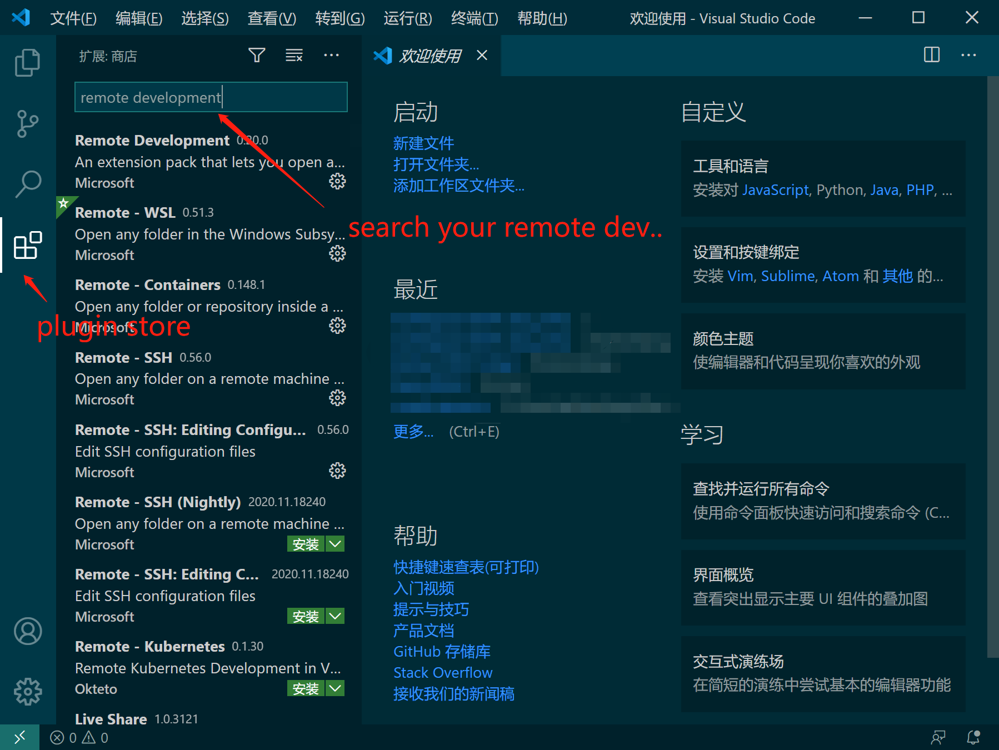
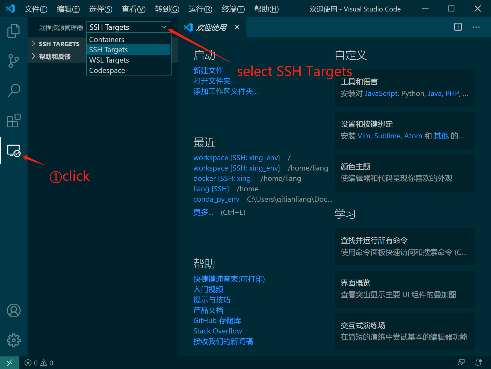
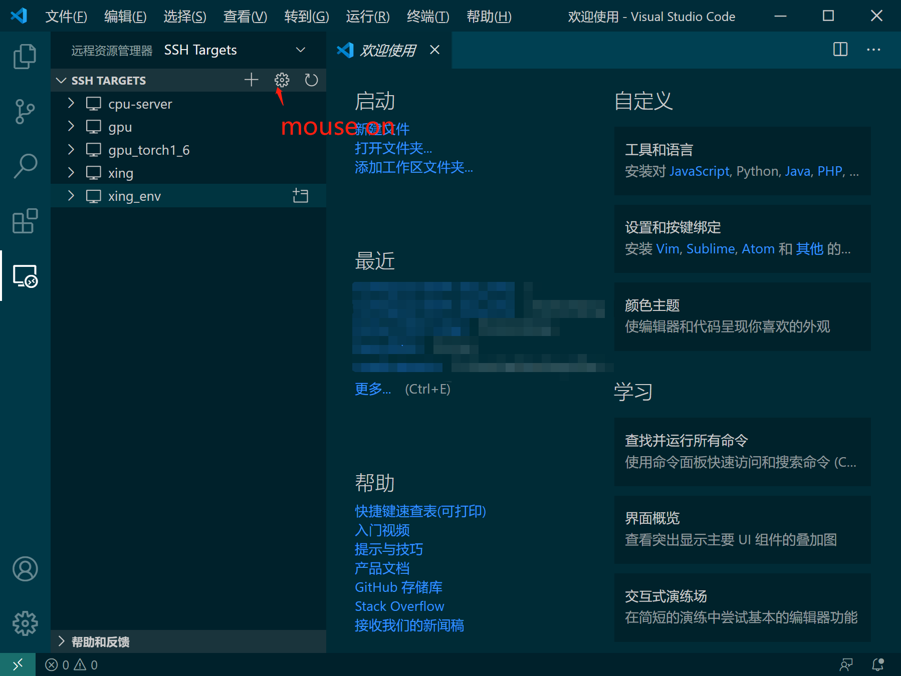
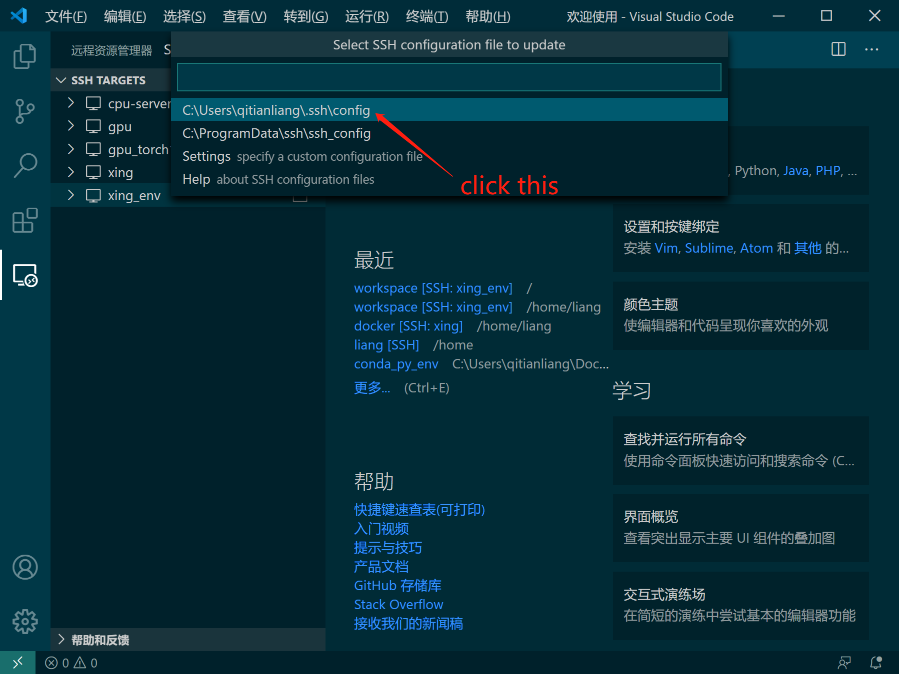
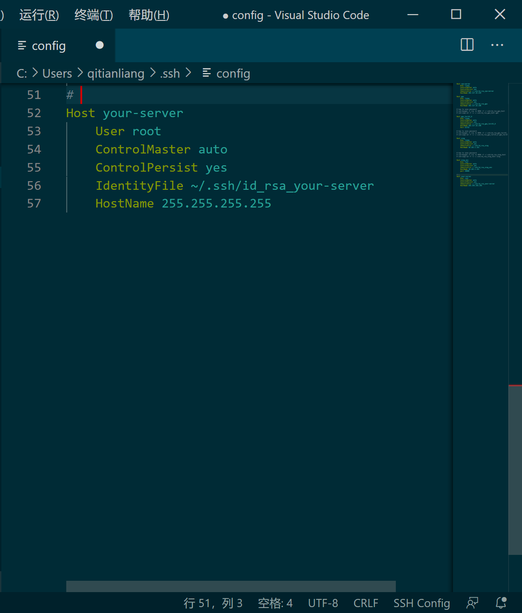
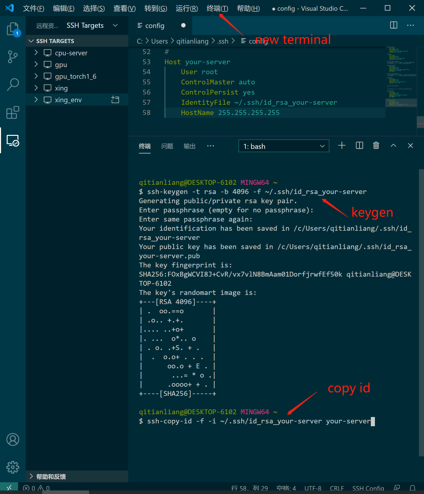
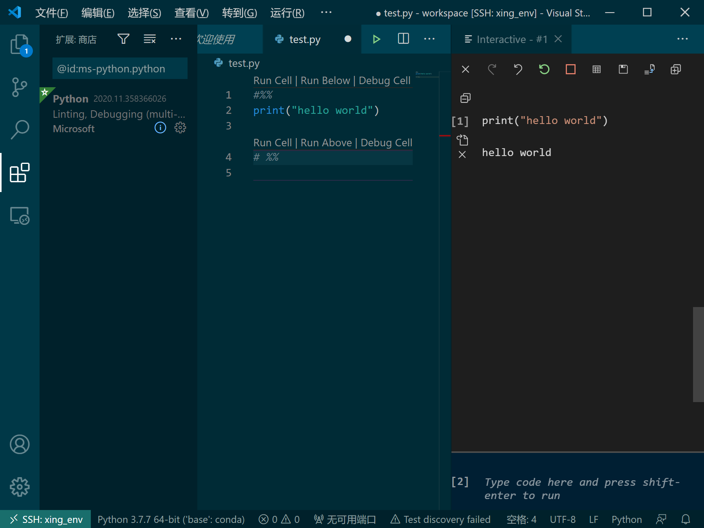

# setup for docker container + conda + vscode

## build public image
    * update ubuntu update source to tsinghua open mirror
    * add `SimHei.ttf` to ubuntu fonts
    * update timezone to `Asia/Shanghai`
    * update conda update source to tsinghua open mirror
    * add tensorflow-gpu to conda base python interpreter

```bash
docker build -t gpu/conda-torch-tensorflow:public .
```

> it provide a public conda environment including `pytorch=1.6.0` and `tensorflow=2.2.0`
> if apt update or conda install break up, may be open mirror site on sync process, wait for some minutes to retry.

if you don't need git credentials, you can simple change your root password by this command `passwd` in your remote bash terminal for your private use.


## build private image

```bash
docker build -f liang.dockerfile -t gpu/conda-torch-tensorflow:liang .
```

> it provide a private conda environment from public image, add `id_rsa` for git and update root password
    
> `id_rsa` generated by `ssh-keygen -t rsa -b 4096 -f ~/.ssh/id_rsa` copy `id_rsa` and `id_rsa.pub` to dir of dockerfile
## create a container
[portainer](https://www.portainer.io/) is recommended, here is the shell script

### bind local persist(optional, highly recommended)
> avoid container size getting larger and larger when you create new python environment for your purpose.

* first install `local persist` on your server host(centos and ubuntu tested)
```bash
curl -fsSL https://raw.githubusercontent.com/MatchbookLab/local-persist/master/scripts/install.sh | sudo bash
```

* create your local persist to mount volume instead just mapping volume

> `mount bind` will not override your container existed folder, if bind not exist, it will raise an error, howerver, `-v` will override this folder by local host 

```
# first create local persist for conda directory
docker volume create -d local-persist -o mountpoint=/host/folder --name=host_large_folder
```

### create your container

```bash
# portainer recommended, (bash script not test)
docker run -d -p 10000:8888 -p 20000:22 -v your/host/path:your/container/path --mount type=bind,source=host_large_folder,target=/container/large/folder  --name your-container-name --restart always --hostname your_virtual_hostname --runtime nvidia gpu/conda-torch-tensorflow:public
```
> portainer is recommended to create this container...

## if you need a new large dataset can be easily access in your container.

*:
```
ln -s /in/your/host/large/dataset /your/container/map/directory/dataset
```

## setup remote development environment in vscode ``local`` 

### plugins: Remote Development(it will install with WSL, Container, SSH and e.t.c)



### save ssh key

1. `remote explorer` > `SSH Targets` > `Configure`(cursor on SSH TARGETS)>`~\.ssh\config`, add those lines into config

```config
Host your-server
    User root
    ControlMaster auto
    ControlPersist yes
    IdentityFile ~/.ssh/id_rsa_your-server
    Port 22000
    HostName 255.255.255.255
```







2. create your rsa file for save key(avoid retype password when connect to remote).

```
ssh-keygen -t rsa -b 4096 -f ~/.ssh/id_rsa_your-server
ssh-copy-id -f -i ~/.ssh/id_rsa_your-server your-server
# input root password, public Dockerfile default is needupdate

```




you can connect without retype password now.


## vscode ``remote`` 

### plugins: Python, Pylance(AI for python autocomplete)


## create your own environments
create a `your_env_file.yaml` like:
```yaml
name : your_env_name
dependencies :
  - python=3.7
  - scikit-learn
  - pip
  - pip:
    - tqdm
```

> notice the blank space between dependencies and `:` is need when you edit this file in `vi` command.

```bash
conda env create -f your_env_file.yaml
conda activate your_env_name
# remove env
conda env remove -n your_env_to_remove_name
```


## conda interpreter path 
interpreter path is base on conda path, this container is `/opt/conda/bin/python`, if you create your env, your interpreter path should like `/opt/conda/envs/your_env_name/bin/python`

enjoy your environment.

## vscode tips:

### creat a file with extension `*.ipynb` will get a jupyter notebook interactive python environment

### insert `#%%` convert `*.py` file to interactive mode



Enjoy your vscode.


